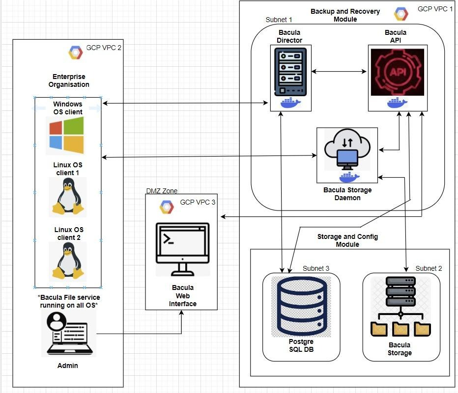

# Respaldo 
#### Submitted by: 
#### Shubham S. Upadhyay, Rakshit Jain, Tanveer Singh, Dhanya Kashyap, Sanjith Ravindra 
#### Capstone Project (Fall 2023), Northeastern University 
------------------------------------------------------------------------------------------
# Description
In today's digital era, data is crucial for organizations. The Secure Remote Backup and Recovery
System project is essential in cybersecurity, aiming to strengthen how businesses protect their
digital assets. With the constant evolution of technology and ongoing cyber threats, robust data
security and resilience are vital. This project recognizes data's importance in influencing 
business strategies and customer relationships, prioritizing its security and recoverability.
Its goal is to develop an advanced system that ensures data protection and empowers
organizations with flexibility and resilience, setting a new standard in data protection
using open-source solutions, encryption, and comprehensive monitoring.

--------------------------------------------------------------------------------------------
# Infrastructure

The diagram illustrates a backup and recovery infrastructure using Bacula, a network backup solution, across three Google Cloud Platform (GCP) Virtual Private Clouds (VPCs). 

In GCP VPC 2, there is an enterprise organization with clients running different operating systems: one Windows OS client and two Linux OS clients. These clients have the Bacula File service running on them.

In GCP VPC 1, there is a Backup and Recovery Module comprising three components:
- Bacula Director, which manages the backup, restore, verify, and archive operations.
- Bacula Storage Daemon, which handles the storage management of backups.
- Bacula API, likely used for programmatically managing and interfacing with the Bacula system.

These components are networked within Subnet 1.

In GCP VPC 3, within a DMZ (Demilitarized Zone), there is a Bacula Web Interface, which provides a user interface to manage and monitor the backup operations.

In the bottom half of the diagram, there are two additional components within GCP VPC 1:
- A PostgreSQL database located in Subnet 3, which is presumably used for storing Bacula's catalog data.
- Bacula Storage within Subnet 2, which is the physical or virtual storage where the backup data is kept.

An admin node is shown outside the VPCs, implying that an administrator can manage the Bacula system remotely.

